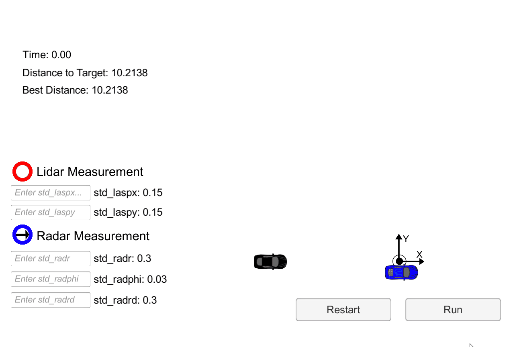

# Run Away Robot with Unscented Kalman Filter Bonus Challenge

---

# Project Goals
---
This is a bonus challenge of the UKF project. In this project UKF implementation for [UKF](https://github.com/atul799/CarND-Unscented-Kalman-Filter-Project) project is used to catch a car.

### Overview

The Runaway car project is based on the UKF project. There is an additional car that is moving in a circular path, the objective of the project is to predict it's location and get within .1 unit distance to consider the runaway car captured. The motion of the car is simulated in the simulator [simulator](https://github.com/udacity/self-driving-car-sim/releases).

The run away car will be sensed by a stationary sensor, that is able to measure both noisy lidar and radar data. The capture vehicle will need to use these measurements to close in on the run away car.However the capture car and the run away car have the same max velocity, so if the capture vehicle wants to catch the car, it will need to predict where the car will be ahead of time.
 
###Strategies applied to catch the runaway car

The file main.cpp has the state prediction based on runaway car sensor data. target_x and target_y variables are assigned for catching car. heading_difference and distance_difference  variables keep track of the difference in heading and distance(Euclidean)  between runaway and catching car.Since the max. velocity between the 2 cars is the same, simply predicting runaway car's location won't work as after a while catching car would follow the runaway car. target_x and target_y needs to be predicted such that catching cars can come closer than 0.1 units to runaway car.

1. Since runaway car is moving in a circular path, simply reversing x-direction of the catching car get the job done. target_x (location of the catching car) is assigned opposite of ukf predicted x position.It takes 4.8 sec to catch the runaway car with this strategy.

target_x = -ukf.x_[0];

target_y = ukf.x_[1];

2.	Add an offset to prediction based on velocity,yaw and yawrate on x position. It takes 5.1 sec to catch runaway car.

target_x = ukf.x_[0] + ukf.x_[2]*cos(ukf.x_[3]) + ukf.x_[4];

target_y = ukf.x_[1];

3.	Take running avg of last 5 prediction errorsof heading direction and distance and add an offset based on this avg. difference to prediction. It takes 4.56 sec to catch runaway car.

for (int i=0;i<5;i++) {

	distance_difference_avg += heading_dist_diff[i];

    heading_difference_avg  += heading_dir_diff[i];

}

distance_difference_avg /=5;

heading_difference_avg /=5;

target_x = ukf.x_[0]-distance_difference_avg*cos(heading_difference_avg);

target_y = ukf.x_[1]+distance_difference_avg*sin(heading_difference_avg);

**Here is the result of the 3rd stategy:**

 *Catching a Runaway Runaway car*

### Running the Code
The 3 strategies mentioned above are implemented in main.cpp file in src directory.
ukf.h/ukf.cpp/measurement.h files are re-used from [UKF](https://github.com/atul799/CarND-Unscented-Kalman-Filter-Project) project.

To run the project:

`mkdir build && cd build`

`cmake .. && make` 

`./UnscentedKF`

**INPUT**: values provided by the simulator to the C++ program

// current noiseless position state of the capture vehicle, called hunter

["hunter_x"]

["hunter_y"]

["hunter_heading"]

// get noisy lidar and radar measurements from the run away car.

["lidar_measurement"]

["radar_measurement"]

**OUTPUT**: values provided by the c++ program to the simulator

// best particle values used for calculating the error evaluation

["turn"] <= the desired angle of the capture car "hunter" no limit for the angle

["dist"] <= the desired distance to move the capture car "hunter" can't move faster than run away car

***Another idea that is not tried here is to create a linear kalman filter for the catching car with x/y as state variables and predict positions with where the runaway car was in previous timestep.**

